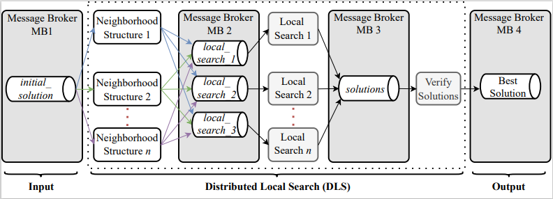

# GDLS-FS: Scaling Feature Selection for Intrusion Detection with GRASP-FS and Distributed Local Search

## Índice
* [Introduction](#introduction)
* [Technology](#technology)
* [Architecture](#architecture)

## Introduction:
    This project presents a scalable microservice-oriented architecture, called Distributed LS (DLS), for enhancing the Local Search (LS) phase in the Greedy
    Randomized Adaptive Search Procedure for Feature Selection (GRASP-FS) meta-heuristic. We distribute the DLS processing among multiple microservices, each
    with a different responsibility. These microservices are decoupled because they communicate with each other by using a message broker through the publish/subscribe
    paradigm. As a proof-of-concept, we implemented an instance of our architecture through the Kafka framework, two neighborhood structures, and three LS algo-rithms.
    These components look for the best solution which is published in a topic to the Intrusion Detection System (IDS). Such a process is iterated continuously to
    improve the solution published, providing IDS with the best feature selection solu-tion at the end of the search process with scalability and time reduction. 
    Our results show that using RVND may take only 19.53% of the time taken by VND. Therefore, the RVND approach is the most efficient for exploiting parallelism in distributed ar-chitectures.
  
  ## Technology:
* Java 17
* Spring Boot 2.7.5
* Kafka
* Weka

## Architecture:

      The GRASP-FS with Distributed LS (GDLS-FS) is a novel microservice-oriented architecture that enables the distribution and parallelism of microservices to solve
    the scalability issues of LS algorithms in the GRASP-FS metaheuristic. GRASP-FS employs machine learning algorithms to process potentially large volumes of
    data in its LS phase. Therefore, these algorithms may cause overhead for processingand slowness depending on the amount of processed data: this is the main 
    bottle-neck of GRASP-FS. In this context, our approach gives scalability to the LSing process, speeding up the convergence to the best solution. To reach more
    scalability,we distribute the LS processing among multiple microservices, each with a different responsibility. These microservices communicate with each other by
    using the publish/subscribe paradigm. Our proposed architecture is illustrated in Figure.

  
  
      Firstly, there is a Message Broker MB1 which is responsible for initializing the proposed LS process by providing an initial solution to be optimized. 
      In GRASP-FS the initial solutions would be provided by specific algorithms, implemented in its constructive phase (the first phase of GRASP-FS), which combines a
      greedy and random procedure. In this work, we focus on the LS only (the second phase of GRASP-FS). 
      Therefore, the component responsible for providing initial solutions should be transparent to our architecture. The process starts whenever an already computed initial solution is given.
    
      The Neighborhood Structure microservices are responsible for handling the LS algorithms. This includes scheduling and feeding them with the initial solution. 
      Therefore, each Neighborhood Structure microservice subscribes to the initial solution topic in MB1 and publishes the received initial solutions, according to 
      its implementation, into one or multiple local search topics in MB2.       Foreach initial solution consumed, the Neighborhood Structure microservice publishes, 
      iteratively, multiple times until it reaches a predefined threshold (e.g., number of iterations, maximum running time, etc.).
    
      The LS microservices implement a set of local movements to derive neighbor solutions (i.e., feature subsets with few features different from the initial 
      solutions) iteratively until reaching a predefined threshold. Every solution generated is assessed by a wrapping-based approach — which employs a machine 
      learning algorithm. Each microservice may implement a distinct LS procedure. Alternatively, they maybe deployed as replicas with redundant implementation for 
      attaining greater scalability due to the smaller overhead of each microservice. Considering replicas for this microservice is relevant since it uses machine 
      learning algorithms to assess the quality of each generated neighbor solution, which may cause the main bottleneck of the proposed architecture. The generated
      solutions are published into the solutions topic of MB3, which is consumed by the interested microservices, such as the VerifySolutions or the Neighborhood 
      Structure microservices that need to receive feedback to perform their next decisions.
      
      Finally, the VerifySolutions microservice subscribes to the solutions topic from MB3 to process and compare all solution founds, regardless of the LS algorithm
      used to find such solutions. In a real and production scenario, a real-time IDS would subscribe to the solutions topic to receive optimized solutions whenever 
      they are generated by our architecture. This procedure avoids the IDS being unnecessarily re-trained when no updated solutions are available and keeps the IDSs 
      continuously updated with the current best-known feature subset.
    

